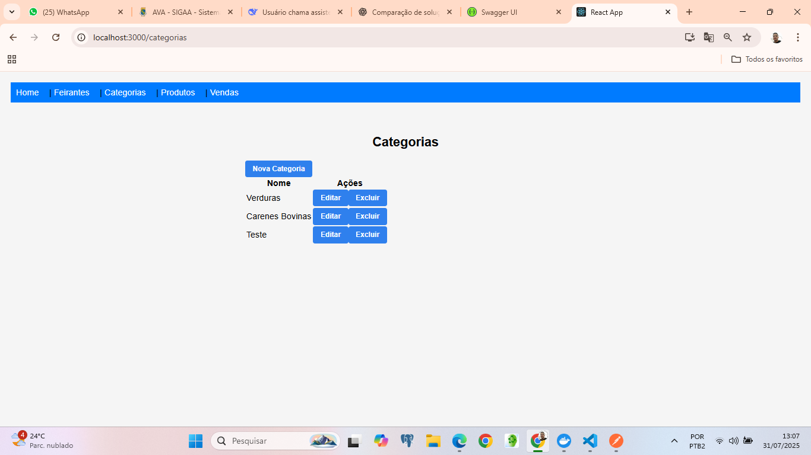
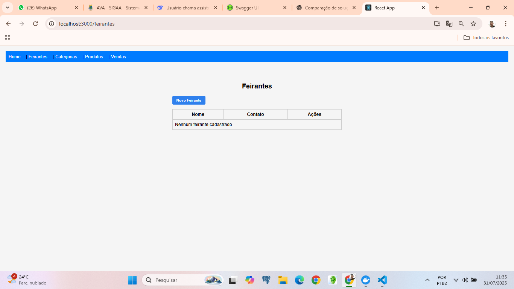
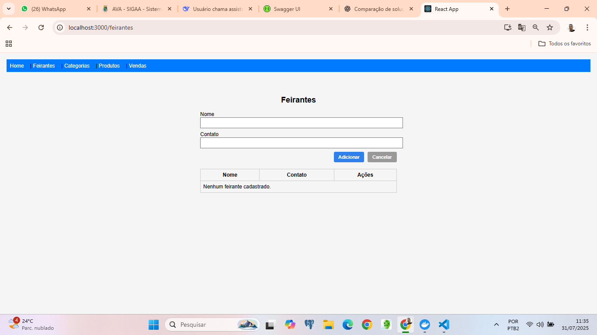
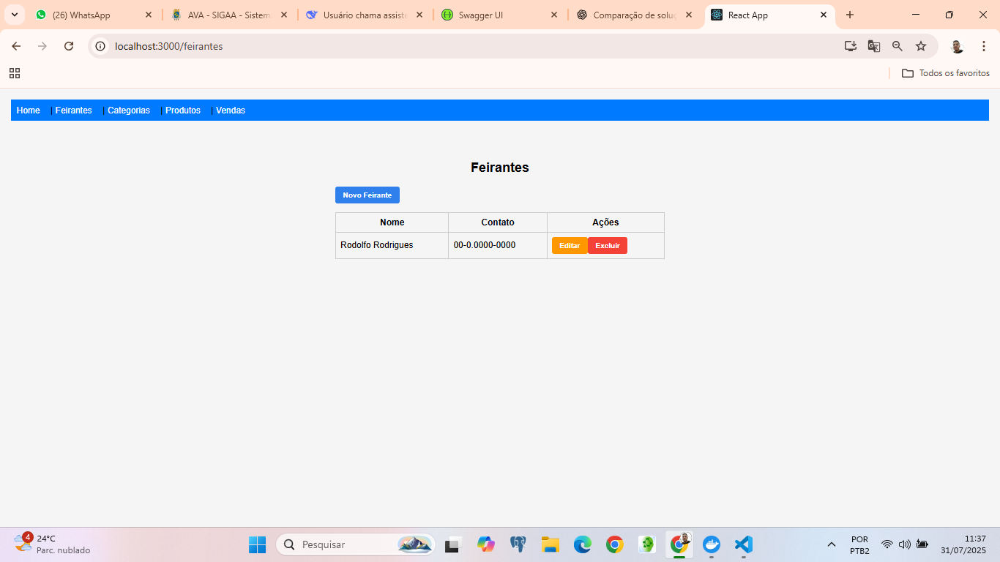
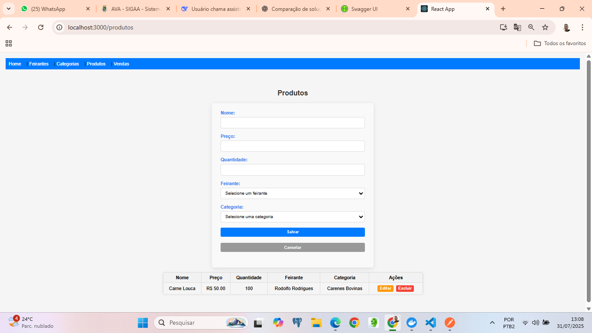
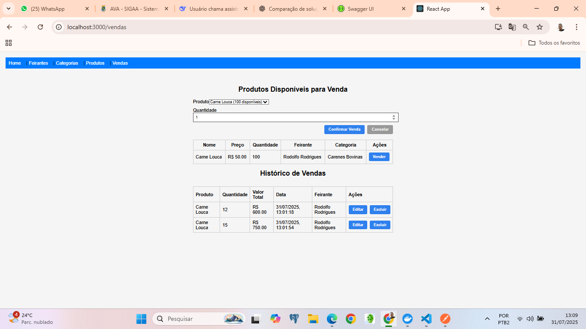
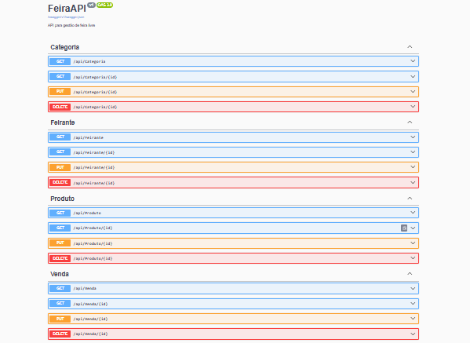
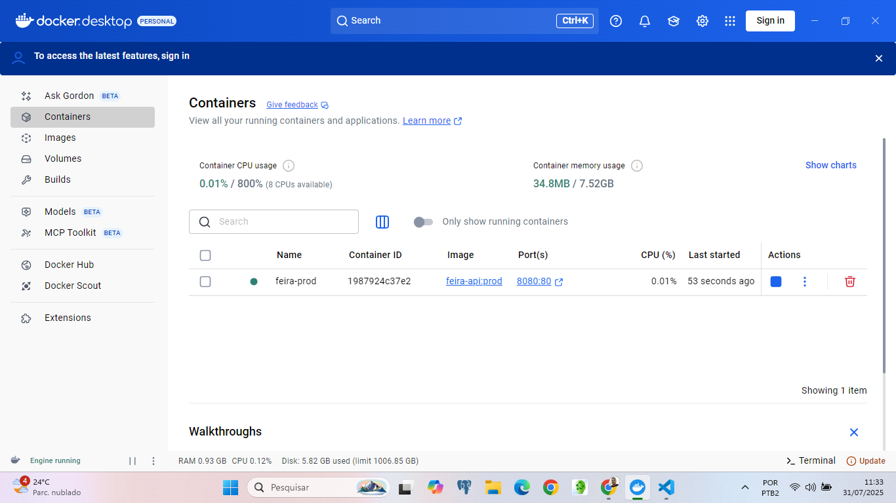
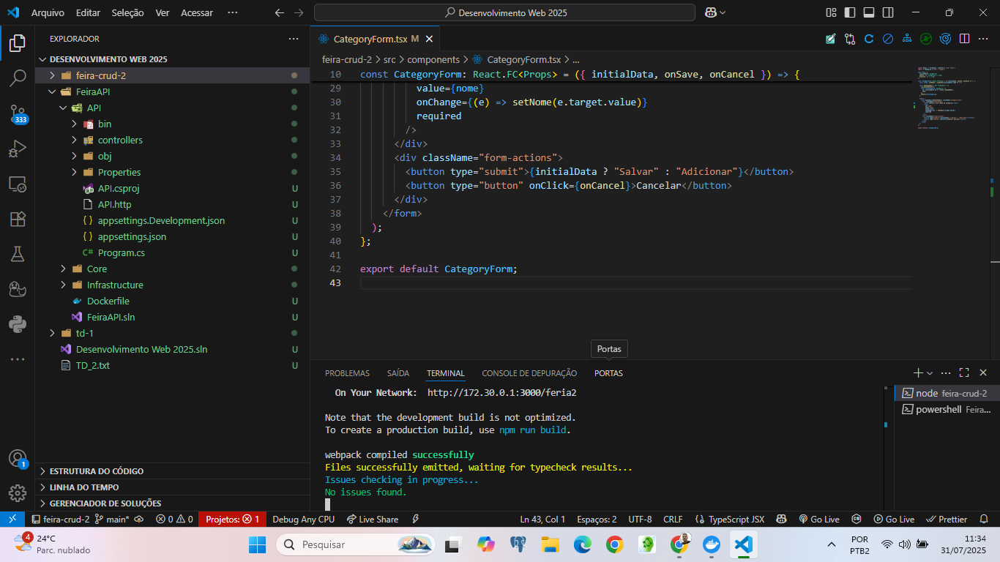

# FeiraAPI 🎯

API e aplicação web completa para gerenciamento de feira livre com funcionalidades de CRUD para **Feirantes**, **Categorias**, **Produtos** e **Vendas**. Backend construído com ASP.NET 8 + Entity Framework e frontend com React + TypeScript. Integração e deploy local via Docker.

## 🔧 Tecnologias Utilizadas

- ASP.NET 8 (Web API)
- Entity Framework Core
- PostgreSQL (via string de conexão)
- React.js + TypeScript
- Docker
- Swagger para documentação de API

## 📸 Funcionalidades e Prints

### ✅ Categorias
- Cadastro, edição e exclusão de categorias.


### ✅ Feirantes
- Gerenciamento de feirantes, incluindo formulário de cadastro e listagem.




### ✅ Produtos
- Cadastro com vínculo a feirante e categoria.
- Edição e exclusão também disponíveis.


### ✅ Vendas
- Cadastro de vendas com validação de estoque.
- Histórico de vendas.


### ✅ Swagger
- Documentação completa da API com suporte aos métodos GET, POST, PUT, DELETE.


### ✅ Docker
- Aplicação publicada com sucesso no Docker rodando na porta 8080.


### ✅ Integração Frontend e Backend
- Frontend React consumindo APIs .NET com CORS liberado e endpoints funcionando corretamente.


## 🚀 Como Executar

### 1. Clone o repositório
```bash
git clone https://github.com/rrodrigues88/feria2.git
cd feira2
```

### 2. Backend via Docker
#### ✅ Build da imagem
```bash

git clone https://github.com/rrodrigues88/feira_api.git
cd feira_api

docker build -t feira-api .
```

#### ▶️ Executar o container
```bash
docker run -p 8080:80 --name feira-prod feira-api
```
Acesse o Swagger via: [http://localhost:8080/swagger/index.html](http://localhost:8080/swagger/index.html)

### 3. Frontend (React)
#### 📦 Instale dependências
```bash
npm install
```
#### ▶️ Inicie o app
```bash
npm run dev

npm start
```
Acesse: [http://localhost:3000](http://localhost:3000)

## ✅ Requisitos Atendidos

- [x] CRUD de Categoria
- [x] CRUD de Feirante
- [x] CRUD de Produto (com vínculos)
- [x] CRUD de Venda com controle de estoque
- [x] Consumo de API REST via React
- [x] Deploy local com Docker
- [x] Documentação Swagger gerada automaticamente

## 👤 Autor

**Rodolfo Rodrigues**  
Curso: Ciência da Computação - UFC  
Disciplina: Desenvolvimento Web - 2025

## 📝 Licença

Este projeto está sob a licença MIT.
